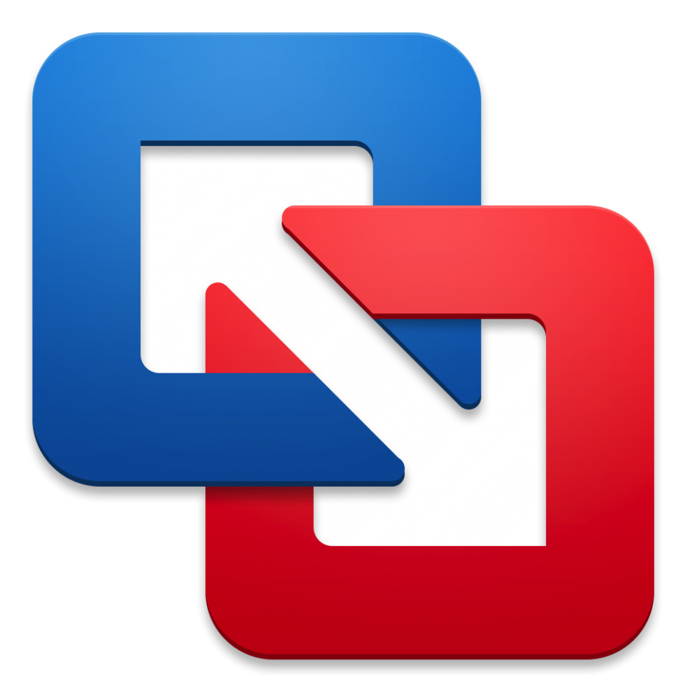

# Virtual Machines (VM)

### April 23, 2024

*Egon A. Ozer, MD PhD (<e-ozer@northwestern.edu>)*  
*Ramon Lorenzo Redondo, PhD (<ramon.lorenzo@northwestern.edu>)*  

---

# 

While the software and analyses used in this workshop can be installed and performed on nearly any modern operating system (PC, Mac, Linux), in practice the differences between computer architectures, operating system versions, and the computing environment including other pre-installed software and settings can make installing and running even the limited software we are using here difficult in a workshop setting. 

To try to minimize an otherwise frustrating and time-consuming process for everyone, we will instead be making use of a [virtual machine (VM)](https://www.vmware.com/topics/glossary/content/virtual-machine.html) preloaded with all the software and data we will be using. Basically this is a "computer within a computer" with its own operating system, software, and functions completely independent of whatever the "host" operating system is of your laptop or desktop computer.   

The *pros* of using a virutal machine here is that for many computers, the excercises should essentially run the same for everyone without software conflicts or many errors that would reqiuire a lot of time to troubleshoot. It's like everyone will be using the same computer.

The *cons* are that to try to include as many different participants as possible, the memory and storage of the virual machine is quite limited (4 Gb RAM, max of 30 Gb of hard disk storage). This greatly limits the usefulness of the virtual machine beyond the workshop exercises. 

*Another con* is that virtual machines tend to run somewhere between a bit to a lot less efficiently than an operating system installed directly onto your computer. But for the short excericses in this workshop, this shouldn't make too much of a difference. 

**Long story short:** If you want to start applying the lessons of this workshop to your own data, you'll probably want to take the time to install the software we use directly onto your own computer or a workstation. We've provided some instructions below that should help you get started. 

### Virtualization software

If you are using the VM on your own computer, you will need a software application to run the VM image. You will only need one of these programs to run the VM.

<a href="https://www.virtualbox.org/">**VirtualBox**</a> (recommended)  

<a href="https://www.vmware.com/products/workstation-player.html">**VMWare Workstation Player**</a> (PC or Linux) OR <a href="https://www.vmware.com/products/fusion/fusion-evaluation.html">**VMWare Fusion**</a> (Macs)

 **ATTENTION:** If you have a newer Mac with a Silicon chip (M1/M2/M3) then you will be unable to run the VM used in this workshop using any of these programs. See [this article](https://communities.vmware.com/t5/VMware-Fusion-Documents/Read-this-before-buying-a-new-Apple-Silicon-Mac-to-run-Fusion/ta-p/2888565) for more detail. Unfortunately, you may also run into more trouble trying to install some of the software directly using instructions from the [earlier](1A_computer_setup.md) [sections](1B_mamba.md).   

---
# OPTIONAL: Create the workshop VM

All of the software used should be able to be installed directly on to your computer using the instructions above. That said, if you would like to set up your own VM where you can continue to experiment with the software without installing anything on your home computer, below are the steps that were used to create our workshop VM in VirtualBox.

* Name: PathGenWS-2024
* ISO Image: lubuntu-22.04.4-desktop-amd64.iso (lubuntu, Debian 12, 64-bit). Obtained from [https://lubuntu.me/downloads/](https://lubuntu.me/downloads/). Direct link: [Desktop 64-bit](https://cdimage.ubuntu.com/lubuntu/releases/22.04.4/release/lubuntu-22.04.4-desktop-amd64.iso)
* Type: Linux
* Version: Ubuntu (64-bit)
* Base Memory: 4096 MB
* Processors: 1 CPU
* Disk Size: 30 GB

On VM startup, select the "Install lubuntu" icon on the desktop and select the defaults.  

* username:cpgme
* password: workshop

Restart the VM. On restart you will get a popup asking if you want to apply upgrades. Select "Yes", then reboot.

### To install Tablet:
* `sudo apt-get install libcanberra-gtk-module`
* Download Tablet (https://ics.hutton.ac.uk/tablet/download-tablet/)

### To install Figtree:

```
sudo apt install figtree
```

### To install R and R Studio: 
Nice guide [here](https://computingforgeeks.com/how-to-install-r-and-rstudio-on-ubuntu-debian-mint/)

```
sudo apt -y install r-base  
wget https://download1.rstudio.org/electron/jammy/amd64/rstudio-2023.12.1-402-amd64.deb  
sudo apt install -f ./rstudio-2023.12.1-402-amd64.deb  
rm rstudio-2023.12.1-402-amd64.deb  
```

### To install Mamba:

```
sudo apt-get install curl
curl -L micro.mamba.pm/install.sh | bash
echo 'alias conda="micromamba"' >> ~/.bashrc
source ~/.bashrc
```

---

# [Back to table of contents](../README.md)

---

<a rel="license" href="http://creativecommons.org/licenses/by-sa/4.0/"></a><br />This work is licensed under a <a rel="license" href="http://creativecommons.org/licenses/by-sa/4.0/">Creative Commons Attribution-ShareAlike 4.0 International License</a>.


  